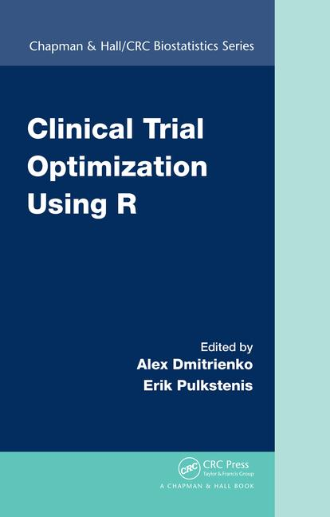



## Summary

  

    
  

[Clinical Trial Optimization Using R](https://www.crcpress.com/Clinical-Trial-Optimization-using-R/Dmitrienko/p/book/9781498735070) explores a unified and broadly applicable framework for optimizing decision making and strategy selection in clinical development, through a series of examples and case studies.It provides the clinical researcher with a powerful evaluation paradigm, as well as supportive R tools, to evaluate and select among simultaneous competing designs or analysis options. It is applicable broadly to statisticians and other quantitative clinical trialists, who have an interest in optimizing clinical trials, clinical trial programs, or associated analytics and decision making.

This book presents in depth the Clinical Scenario Evaluation (CSE) framework, and discusses optimization strategies, including the quantitative assessment of tradeoffs. A variety of common development challenges are evaluated as case studies, and used to show how this framework both simplifies and optimizes strategy selection. Specific settings include optimizing adaptive designs, multiplicity and subgroup analysis strategies, and overall development decision-making criteria around Go/No-Go. After this book, the reader will be equipped to extend the CSE framework to their particular development challenges as well.

The book is divided into four chapters:

1. **Clinical Scenario Evaluation and Clinical Trial Optimization**, by Alex Dmitrienko and Gautier Paux

2. **Clinical Trials with Multiple Objectives**, by Alex Dmitrienko and Gautier Paux

3. **Subgroup Analysis in Clinical Trials**, by Alex Dmitrienko and Gautier Paux

4. **Decision Making in Clinical Development**, by Kaushik Patra, Ming-Dauh Wang, Jianliang Zhang, Aaron Dane, Paul Metcalfe, Paul Frewer, and Erik Pulkstenis

Case studies included in Chapter 2 and 3 were implemented using the Mediana R package. The case studies details and R code are provided in this web site.

## Clinical Trials with Multiple Objectives

This chapter introduce key concepts of clinical trial optimization in the context of clinical trials with multiplicity issues. Three case studies illustrates several approaches to identify efficient multiplicity adjustment procedure and/or parameters set with the goal of maximizing the probability of success in a single trial or development program. Assessment of performance are facilitated using the Clinical Scenario Evaluation Framework and the Mediana R package which provides a turnkey solution in this context.

1. [Case study 1](mult_CaseStudy01.html)

2. [Case study 2](mult_CaseStudy02.html)

3. [Case study 3](mult_CaseStudy03.html)

## Subgroup Analysis in Clinical Trials

On construction