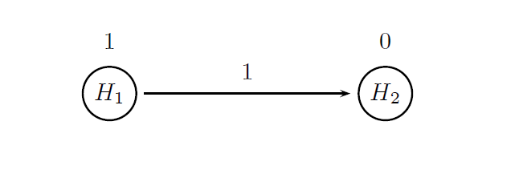
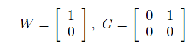



## Summary

Case study 4 serves as an extension of the oncology clinical trial example presented in [Case study 1](CaseStudy01.html). Consider again a Phase III trial in patients with metastatic colorectal cancer (MCC). The same general design will be assumed in this section; however, an additional endpoint (overall survival) will be introduced. The case of two endpoints helps showcase the package's ability to model complex design and analysis strategies in trials with multivariate outcomes.

Progression-free survival (PFS) is the primary endpoint in this clinical trial and overall survival (OS) serves as the key secondary endpoint, which provides supportive evidence of treatment efficacy. A hierarchical testing approach will be utilized in the analysis of the two endpoints. The PFS analysis will be performed first at &alpha; = 0.025 (one-sided), followed by the OS analysis at the same level if a significant effect on PFS is established. The resulting testing procedure is equivalent to the fixed-sequence procedure and controls the overall Type I error rate ([Dmitrienko and D’Agostino, 2013](http://onlinelibrary.wiley.com/doi/10.1002/sim.5990/abstract)).

The treatment effect assumptions that will be used in clinical scenario evaluation are listed in the table below. The table shows the hypothesized median times along with the corresponding hazard rates for the primary and secondary endpoints. It follows from the table that the expected effect size is much larger for PFS compared to OS (PFS hazard ratio is lower than OS hazard ratio).

    <table class="table">
        <thead>
            <tr>
                <th colspan="2">Endpoint</th>
                <th>Placebo</th>
                <th>Treatment</th>
            </tr>
        </thead>
        <tbody>
            <tr>
                <td rowspan="4">Progression-free survival</td>
            </tr>
            <tr>
                <td>Median time (months)</td>
                <td>6</td>
                <td>9</td>
            </tr>
            <tr>
                <td>Hazard rate</td>
                <td>0.116</td>
                <td>0.077</td>
            </tr>
            <tr>
                <td>Hazard ratio</td>
                <td colspan="2">0.67</td>
            </tr>
            <tr>
                <td rowspan="4">Overall survival</td>
            </tr>
            <tr>
                <td>Median time (months)</td>
                <td>15</td>
                <td>19</td>
            </tr>
            <tr>
                <td>Hazard rate</td>
                <td>0.046</td>
                <td>0.036</td>
            </tr>
            <tr>
                <td>Hazard ratio</td>
                <td colspan="2">0.79</td>
            </tr>
        </tbody>
    </table>

## Define a Data Model

In this clinical trial two endpoints are evaluated for each patient (PFS and OS) and thus their joint distribution needs to be listed in the general set.

A bivariate exponential distribution will be used in this example and samples from this bivariate distribution will be generated by the `MVExpoPFSOSDist` function which implements multivariate exponential distributions. The function utilizes the copula method, i.e., random variables that follow a bivariate normal distribution will be generated and then converted into exponential random variables.

The next several statements specify the parameters of the bivariate exponential distribution:

- Parameters of the marginal exponential distributions, i.e., the hazard rates.

- Correlation matrix of the underlying multivariate normal distribution used in the copula method.

The hazard rates for PFS and OS in each treatment arm are defined based on
the information presented in the table above (`placebo.par` and `treatment.par`) and the correlation matrix is specified based on historical information (`corr.matrix`). These parameters are combined to define the outcome parameter sets (`outcome.placebo` and  `outcome.treatment`) that will be included in the sample-specific set of data model parameters (`Sample` object).


# Outcome parameters: Progression-free survival
median.time.pfs.placebo = 6
rate.pfs.placebo = log(2)/median.time.pfs.placebo
outcome.pfs.placebo = parameters(rate = rate.pfs.placebo)
median.time.pfs.treatment = 9

rate.pfs.treatment = log(2)/median.time.pfs.treatment
outcome.pfs.treatment = parameters(rate = rate.pfs.treatment)
hazard.pfs.ratio = rate.pfs.treatment/rate.pfs.placebo

# Outcome parameters: Overall survival
median.time.os.placebo = 15
rate.os.placebo = log(2)/median.time.os.placebo
outcome.os.placebo = parameters(rate = rate.os.placebo)
median.time.os.treatment = 19

rate.os.treatment = log(2)/median.time.os.treatment
outcome.os.treatment = parameters(rate = rate.os.treatment)
hazard.os.ratio = rate.os.treatment/rate.os.placebo

# Parameter lists
placebo.par = parameters(parameters(rate = rate.pfs.placebo), 
                         parameters(rate = rate.os.placebo))

treatment.par = parameters(parameters(rate = rate.pfs.treatment), 
                           parameters(rate = rate.os.treatment))

# Correlation between two endpoints
corr.matrix = matrix(c(1.0, 0.3,
                       0.3, 1.0), 2, 2)

# Outcome parameters
outcome.placebo = parameters(par = placebo.par, corr = corr.matrix)
outcome.treatment = parameters(par = treatment.par, corr = corr.matrix)


To define the sample-specific data model parameters, a 2:1 randomization ratio will be used in this clinical trial and thus the number of events as well as the randomization ratio are specified by the user in the `Event` object. Secondly, a separate sample ID needs to be assigned to each endpoint within the two samples (e.g. `Placebo PFS` and `Placebo OS`) corresponding to the two treatment arms. This will enable the user to construct analysis models for examining the treatment effect on each endpoint.


# Number of events
event.count.total = c(270, 300)
randomization.ratio = c(1, 2)

# Data model
case.study4.data.model = DataModel() +
  OutcomeDist(outcome.dist = "MVExpoPFSOSDist") +
  Event(n.events = event.count.total, 
        rando.ratio = randomization.ratio) +
  Sample(id = list("Placebo PFS", "Placebo OS"),
         outcome.par = parameters(outcome.placebo)) +
  Sample(id = list("Treatment PFS", "Treatment OS"),
         outcome.par = parameters(outcome.treatment))


## Define an Analysis Model

The treatment comparisons for both endpoints will be carried out based on the log-rank test (`method = "LogrankTest"`). Further, as was stated in the beginning of this page, the two endpoints will be tested hierarchically using a multiplicity adjustment procedure known as the fixed-sequence procedure. This procedure belongs to the class of chain procedures (`proc = "ChainAdj"`) and the following figure provides a visual summary of the decision rules used in this procedure. 

  

    
  

The circles in this figure denote the two null hypotheses of interest:

- H1: Null hypothesis of no difference between the two arms with respect to PFS.

- H2: Null hypothesis of no difference between the two arms with respect to OS.

The value displayed above a circle defines the initial weight of each null hypothesis.
All of the overall &alpha; is allocated to H1 to ensure that the OS test will be carried out only after the PFS test is significant and the arrow indicates that H2 will be tested
after H1 is rejected.

More formally, a chain procedure is uniquely defined by specifying a vector of hypothesis weights (W) and matrix of transition parameters (G). Based on the figure, these parameters are given by

  

    
  

Two objects (named `chain.weight` and `chain.transition`) are defined below to pass the hypothesis weights and transition parameters to the multiplicity adjustment parameters.


# Parameters of the chain procedure (fixed-sequence procedure)
# Vector of hypothesis weights
chain.weight = c(1, 0)
# Matrix of transition parameters
chain.transition = matrix(c(0, 1,
                            0, 0), 2, 2, byrow = TRUE)

# Analysis model
case.study4.analysis.model = AnalysisModel() +
  MultAdjProc(proc = "ChainAdj",
              par = parameters(weight = chain.weight, transition = chain.transition)) +
  Test(id = "PFS test",
       samples = samples("Placebo PFS", "Treatment PFS"),
       method = "LogrankTest") +
  Test(id = "OS test",
       samples = samples("Placebo OS", "Treatment OS"),
       method = "LogrankTest")


As shown above, the two significance tests included in the analysis model reflect the two-fold objective of this trial. The first test focuses on a PFS comparison between the two treatment arms (`id = "PFS test"`) whereas the other test is carried out to assess the treatment effect on OS (`test.id = "OS test"`).

Alternatively, the fixed-sequence procedure can be implemented using the method `FixedSeqAdj` introduced from version 1.0.4. This implementation is facilitated as no parameters have to be specified.


# Analysis model
case.study4.analysis.model = AnalysisModel() +
  MultAdjProc(proc = "FixedSeqAdj") +
  Test(id = "PFS test",
       samples = samples("Placebo PFS", "Treatment PFS"),
       method = "LogrankTest") +
  Test(id = "OS test",
       samples = samples("Placebo OS", "Treatment OS"),
       method = "LogrankTest")


## Define an Evaluation Model

The evaluation model specifies the most basic criterion for assessing the probability
of success in the PFS and OS analyses (marginal power). A criterion based on disjunctive power could be considered but it would not provide additional information.

Due to the hierarchical testing approach, the probability of detecting a significant
treatment effect on at least one endpoint (disjunctive power) is simply equal to the
probability of establishing a significant PFS effect.


# Evaluation model
case.study4.evaluation.model = EvaluationModel() +
  Criterion(id = "Marginal power",
            method = "MarginalPower",
            tests = tests("PFS test",
                          "OS test"),
            labels = c("PFS test",
                       "OS test"),
            par = parameters(alpha = 0.025))


## Download

Click on the icons below to download the R code used in this case study and report that summarizes the results of Clinical Scenario Evaluation:

  

    
  

  

    
  

