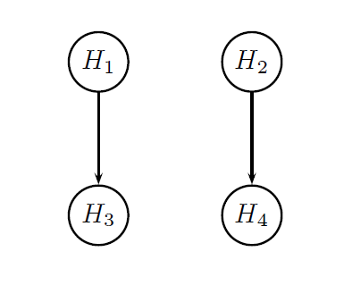



## Summary

This case study extends the straightforward setting presented in [Case study 1](CaseStudy01.html) to a more complex setting involving two trial endpoints and three treatment arms. Case study 5 illustrates the process of performing power calculations in clinical trials with multiple, hierarchically structured objectives and "multivariate" multiplicity adjustment strategies (gatekeeping procedures).

Consider a three-arm Phase III clinical trial for the treatment of rheumatoid arthritis (RA). Two co-primary endpoints will be used to evaluate the effect of a novel treatment on clinical response and on physical function. The endpoints are defined as follows:

- Endpoint 1: Response rate based on the American College of Rheumatology definition of improvement (ACR20).
 
- Endpoint 2: Change from baseline in the Health Assessment Questionnaire-Disability Index (HAQ-DI).
 
The two endpoints have different marginal distributions. The first endpoint is binary whereas the second one is continuous and follows a normal distribution.

The efficacy profile of two doses of a new treatment (Doses L and Dose H) will be compared to that of a placebo and a successful outcome will be defined as a significant treatment effect at either or both doses. A hierarchical structure has been established within each dose so that Endpoint 2 will be tested if and only if there is evidence of a significant effect on Endpoint 1.

Three treatment effect scenarios for each endpoint are displayed in the table below. The scenarios define three outcome parameter sets. The first set represents a rather conservative treatment effect scenario, the second set is a standard (most plausible) scenario and the third set represents an optimistic scenario. Note that a reduction in the HAQ-DI score indicates a beneficial effect and thus the mean changes are assumed to be negative for Endpoint 2.

    <table class="table">
        <thead>
            <tr>
                <th>Endpoint</th>
                <th>Outcome parameter set</th>
                <th>Placebo</th>
                <th>Dose L</th>
                <th>Dose H</th>
            </tr>
        </thead>
        <tbody>
            <tr>
                <td rowspan="4">ACR20 (%)</td>
            </tr>
            <tr>
                <td>Conservative</td>
                <td>30%</td>
                <td>40%</td>
                <td>50%</td>
            </tr>
            <tr>
                <td>Standard</td>
                <td>30%</td>
                <td>45%</td>
                <td>55%</td>
            </tr>
            <tr>
                <td>Optimistic</td>
                <td>30%</td>
                <td>50%</td>
                <td>60%</td>
            </tr>
            <tr>
                <td rowspan="4">HAQ-DI (mean (SD))</td>
            </tr>
            <tr>
                <td>Conservative</td>
                <td>−0.10 (0.50)</td>
                <td>−0.20 (0.50)</td>
                <td>−0.30 (0.50)</td>
            </tr>
            <tr>
                <td>Standard</td>
                <td>−0.10 (0.50)</td>
                <td>−0.25 (0.50)</td>
                <td>−0.35 (0.50)</td>
            </tr>
            <tr>
                <td>Optimistic</td>
                <td>−0.10 (0.50)</td>
                <td>−0.30 (0.50)</td>
                <td>−0.40 (0.50)</td>
            </tr>
        </tbody>
    </table>

## Define a Data Model

As in [Case study 4](CaseStudy04.html), two endpoints are evaluated for each patient in this clinical trial example, which means that their joint distribution needs to be specified. The `MVMixedDist` method will be utilized for specifying a bivariate distribution with binomial and normal marginals (`var.type = list("BinomDist", "NormalDist")`). In general, this function is used for modeling correlated normal, binomial and exponential endpoints and relies on the copula method, i.e., random variables are generated from a multivariate normal distribution and converted into variables with pre-specified marginal distributions.

Three parameters must be defined to specify the joint distribution of Endpoints 1 and 2 in this clinical trial example:

- Variable types (binomial and normal).

- Outcome distribution parameters (proportion for Endpoint 1, mean and SD for Endpoint 2) based on the assumptions listed in the Table above.

- Correlation matrix of the multivariate normal distribution used in the copula method.

These parameters are combined to define three outcome parameter sets (e.g., `outcome1.plac `,  `outcome1.dosel ` and  `outcome1.doseh `) that will be included in the `Sample` object in the
data model. 


# Variable types
var.type = list("BinomDist", "NormalDist")

# Outcome distribution parameters
placebo.par = parameters(parameters(prop = 0.3), 
                         parameters(mean = -0.10, sd = 0.5))

dosel.par1 = parameters(parameters(prop = 0.40), 
                        parameters(mean = -0.20, sd = 0.5))
dosel.par2 = parameters(parameters(prop = 0.45), 
                        parameters(mean = -0.25, sd = 0.5))
dosel.par3 = parameters(parameters(prop = 0.50), 
                        parameters(mean = -0.30, sd = 0.5))

doseh.par1 = parameters(parameters(prop = 0.50), 
                        parameters(mean = -0.30, sd = 0.5))
doseh.par2 = parameters(parameters(prop = 0.55), 
                        parameters(mean = -0.35, sd = 0.5))
doseh.par3 = parameters(parameters(prop = 0.60), 
                        parameters(mean = -0.40, sd = 0.5))

# Correlation between two endpoints
corr.matrix = matrix(c(1.0, 0.5,
                       0.5, 1.0), 2, 2)

# Outcome parameter set 1
outcome1.placebo = parameters(type = var.type, 
                              par = placebo.par, 
                              corr = corr.matrix)
outcome1.dosel = parameters(type = var.type, 
                            par = dosel.par1, 
                            corr = corr.matrix)
outcome1.doseh = parameters(type = var.type, 
                            par = doseh.par1, 
                            corr = corr.matrix)

# Outcome parameter set 2
outcome2.placebo = parameters(type = var.type, 
                              par = placebo.par, 
                              corr = corr.matrix)
outcome2.dosel = parameters(type = var.type, 
                            par = dosel.par2, 
                            corr = corr.matrix)
outcome2.doseh = parameters(type = var.type, 
                            par = doseh.par2, 
                            corr = corr.matrix)

# Outcome parameter set 3
outcome3.placebo = parameters(type = var.type, 
                              par = placebo.par, 
                              corr = corr.matrix)
outcome3.doseh = parameters(type = var.type, 
                            par = doseh.par3, 
                            corr = corr.matrix)
outcome3.dosel = parameters(type = var.type, 
                            par = dosel.par3, 
                            corr = corr.matrix)


These outcome parameter set are then combined within each `Sample` object and the common sample size per treatment arm ranges between 100 and 120:


# Data model
case.study5.data.model = DataModel() +
  OutcomeDist(outcome.dist = "MVMixedDist") +
  SampleSize(c(100, 120)) +
  Sample(id = list("Placebo ACR20", "Placebo HAQ-DI"),
         outcome.par = parameters(outcome1.placebo, outcome2.placebo, outcome3.placebo)) +
  Sample(id = list("DoseL ACR20", "DoseL HAQ-DI"),
         outcome.par = parameters(outcome1.dosel, outcome2.dosel, outcome3.dosel)) +
  Sample(id = list("DoseH ACR20", "DoseH HAQ-DI"),
         outcome.par = parameters(outcome1.doseh, outcome2.doseh, outcome3.doseh))


## Define an Analysis Model

To set up the analysis model in this clinical trial example, note that the treatment comparisons for Endpoints 1 and 2 will be carried out based on two different statistical tests:

- Endpoint 1: Two-sample test for comparing proportions (`method = "PropTest"`).

- Endpoint 2: Two-sample t-test (`method = "TTest"`).
 
It was pointed out earlier in this page that the two endpoints will be tested hierarchically within each dose. The figure below provides a visual summary of the testing strategy used in this clinical trial. The circles in this figure denote the four null hypotheses of interest:

H1: Null hypothesis of no difference between Dose L and placebo with respect to
Endpoint 1.

H2: Null hypothesis of no difference between Dose H and placebo with respect
to Endpoint 1.

H3: Null hypothesis of no difference between Dose L and placebo with respect to
Endpoint 2.

H4: Null hypothesis of no difference between Dose H and placebo with respect
to Endpoint 2.

  

    
  

A multiple testing procedure known as the multiple-sequence gatekeeping procedure will be applied to account for the hierarchical structure of this multiplicity problem. This procedure belongs to the class of mixture-based gatekeeping procedures introduced in [Dmitrienko et al. (2015)](http://www.tandfonline.com/doi/abs/10.1080/10543406.2015.1074917). This gatekeeping procedure is specified by defining the following three parameters:

- Families of null hypotheses (`family`).
 
- Component procedures used in the families (`component.procedure`).

- Truncation parameters used in the families (`gamma`).


# Parameters of the gatekeeping procedure procedure (multiple-sequence gatekeeping procedure)
# Tests to which the multiplicity adjustment will be applied
test.list = tests("Placebo vs DoseH - ACR20", 
                  "Placebo vs DoseL - ACR20", 
                  "Placebo vs DoseH - HAQ-DI", 
                  "Placebo vs DoseL - HAQ-DI")

# Families of hypotheses
family = families(family1 = c(1, 2), 
                  family2 = c(3, 4))

# Component procedures for each family
component.procedure = families(family1 ="HolmAdj", 
                               family2 = "HolmAdj")

# Truncation parameter for each family
gamma = families(family1 = 0.8, 
                 family2 = 1)


These parameters are included in the `MultAdjProc` object defined below. The tests to which the multiplicity adjustment will be applied are defined in the `tests` argument. The use of this argument is optional if all tests included in the analysis model are to be included. The argument `family` states that the null hypotheses will be grouped into two families:

- Family 1: H1 and H2.

- Family 2: H3 and H4.

It is to be noted that the order corresponds to the order of the tests defined in the analysis model, except if the tests are specifically specified in the `tests` argument of the `MultAdjProc` object.

The families will be tested sequentially and a truncated Holm procedure will be applied within each family (`component.procedure`). Lastly, the truncation parameter will be set to 0.8 in Family 1 and to 1 in Family 2 (`gamma`). The resulting parameters are included in the `par` argument of the `MultAdjProc` object and, as before, the `proc` argument is used to specify the multiple testing procedure (`MultipleSequenceGatekeepingAdj`).

The test are then specified in the analysis model and the overall analysis model is defined as follows:


# Analysis model
case.study5.analysis.model = AnalysisModel() +
  MultAdjProc(proc = "MultipleSequenceGatekeepingAdj",
              par = parameters(family = family, 
                               proc = component.procedure, 
                               gamma = gamma),
              tests = test.list) +
  Test(id = "Placebo vs DoseL - ACR20",
       method = "PropTest",
       samples = samples("Placebo ACR20", "DoseL ACR20")) +
  Test(id = "Placebo vs DoseH - ACR20",
       method = "PropTest",
       samples = samples("Placebo ACR20", "DoseH ACR20")) +
  Test(id = "Placebo vs DoseL - HAQ-DI",
       method = "TTest",
       samples = samples("DoseL HAQ-DI", "Placebo HAQ-DI")) +
  Test(id = "Placebo vs DoseH - HAQ-DI",
       method = "TTest",
       samples = samples("DoseH HAQ-DI", "Placebo HAQ-DI"))


Recall that a numerically lower value indicates a beneficial effect for the HAQ-DI score and, as a result, the experimental treatment arm must be defined prior to the placebo arm in the test.samples parameters corresponding to the HAQ-DI tests, e.g., `samples = samples("DoseL HAQ-DI", "Placebo HAQ-DI")`.

## Define an Evaluation Model

In order to assess the probability of success in this clinical trial, a hybrid criterion based on the conjunctive criterion (both trial endpoints must be significant) and disjunctive criterion (at least one dose-placebo comparison must be significant) can be considered. 

This criterion will be met if a significant effect is established at one or two doses on Endpoint 1 (ACR20) and also at one or two doses on Endpoint 2 (HAQ-DI). However, due to the hierarchical structure of the testing strategy (see Figure), this is equivalent to demonstrating a significant difference between Placebo and at least one dose with respect to Endpoint 2. The corresponding criterion is a subset disjunctive criterion based on the two Endpoint 2 tests (subset disjunctive power was briefly mentioned in [Case study 2](CaseStudy02)). 

In addition, the sponsor may also be interested in evaluating marginal power as well as subset disjunctive power based on the Endpoint 1 tests. The latter criterion will be met if a significant difference between Placebo and at least one dose is established with respect
to Endpoint 1. Additionally, as in [Case study 2](CaseStudy02), the user could consider defining custom evaluation criteria. The three resulting evaluation criteria (marginal power, subset disjunctive criterion based on the Endpoint 1 tests and subset disjunctive criterion based on the Endpoint 2 tests) are included in the following evaluation model.


# Evaluation model
case.study5.evaluation.model = EvaluationModel() +
  Criterion(id = "Marginal power",
            method = "MarginalPower",
            tests = tests("Placebo vs DoseL - ACR20",
                          "Placebo vs DoseH - ACR20",
                          "Placebo vs DoseL - HAQ-DI",
                          "Placebo vs DoseH - HAQ-DI"),
            labels = c("Placebo vs DoseL - ACR20",
                       "Placebo vs DoseH - ACR20",
                       "Placebo vs DoseL - HAQ-DI",
                       "Placebo vs DoseH - HAQ-DI"),
            par = parameters(alpha = 0.025)) +
  Criterion(id = "Disjunctive power - ACR20",
            method = "DisjunctivePower",
            tests = tests("Placebo vs DoseL - ACR20",
                          "Placebo vs DoseH - ACR20"),
            labels = "Disjunctive power - ACR20",
            par = parameters(alpha = 0.025)) +
  Criterion(id = "Disjunctive power - HAQ-DI",
            method = "DisjunctivePower",
            tests = tests("Placebo vs DoseL - HAQ-DI",
                          "Placebo vs DoseH - HAQ-DI"),
            labels = "Disjunctive power - HAQ-DI",
            par = parameters(alpha = 0.025))


## Download

Click on the icons below to download the R code used in this case study and report that summarizes the results of Clinical Scenario Evaluation:

  

    
  

  

    
  

