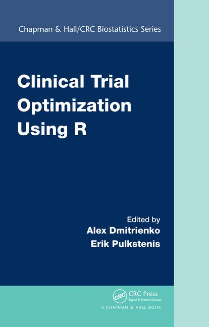



 

## Clinical trial optimization using R

  

    
  

[Clinical Trial Optimization Using R](https://www.crcpress.com/Clinical-Trial-Optimization-using-R/Dmitrienko/p/book/9781498735070) explores a unified and broadly applicable framework for optimizing decision making and strategy selection in clinical development, through a series of examples and case studies.It provides the clinical researcher with a powerful evaluation paradigm, as well as supportive R tools, to evaluate and select among simultaneous competing designs or analysis options. It is applicable broadly to statisticians and other quantitative clinical trialists, who have an interest in optimizing clinical trials, clinical trial programs, or associated analytics and decision making.

This book presents in depth the Clinical Scenario Evaluation (CSE) framework, and discusses optimization strategies, including the quantitative assessment of tradeoffs. A variety of common development challenges are evaluated as case studies, and used to show how this framework both simplifies and optimizes strategy selection. Specific settings include optimizing adaptive designs, multiplicity and subgroup analysis strategies, and overall development decision-making criteria around Go/No-Go. After this book, the reader will be equipped to extend the CSE framework to their particular development challenges as well.

Mediana R package has been widely used to implement the case studies presented in this book. The detailed description and R code of these case studies are available on this website.

## New release ! 

The version 1.0.4 of the Mediana R package has been released on 07 February 2017. This latest stable version can be downloaded from the [CRAN website](https://cran.r-project.org/web/packages/Mediana/index.html). The principal revisions compared to the previous version include the following features:

- Addition of the Fixed-sequence procedure (`FixedSeqAdj`, see [Analysis model](http://gpaux.github.io/Mediana/AnalysisModel.html#MultAdjProcobject)).

- Addition of the Cox method to calculate the HR, effect size and ratio of effect size for time-to-event endpoint. This can be accomplished by setting the  `method` argument in the parameter list to set-up the calculation based on the Cox method. (`par = parameters(method = "Cox"`), see [Analysis model](http://gpaux.github.io/Mediana/AnalysisModel.html#Statisticobject)).

- Addition of the package version information in the report.

- Revision of one-sided p-value computation for Log-Rank test.

- Revision of the function to calculate the Hazard Ratio Statistic (HazardRatioStat method). By default, this calculation is now based on the log-rank statistic ((O2/E2)/(O1/E1) where O and E are Observed and Expected event in sample 2 and sample 1. A parameter can be added using the `method` argument in the parameter list to set-up the calculation based on the Cox method (`par = parameters(method = "Cox"`), see [Analysis model](http://gpaux.github.io/Mediana/AnalysisModel.html#Statisticobject)).

- Some bug fixes.

## About

Mediana is an R package which provides a general framework for clinical trial simulations based on the Clinical Scenario Evaluation approach. The package supports a broad class of data models (including clinical trials with continuous, binary, survival-type and count-type endpoints as well as multivariate outcomes that are based on combinations of different endpoints), analysis strategies and commonly used evaluation criteria.

## Expert and development teams

**Package design**: [Alex Dmitrienko (Mediana Inc.)](http://www.medianainc.com/).

**Core development team**: [Gautier Paux (Servier)](http://www.linkedin.com/in/pauxgautier), [Alex Dmitrienko (Mediana Inc.)](http://www.medianainc.com/).

**Extended development team**: Thomas Brechenmacher (Novartis), Fei Chen (Johnson and Johnson), Ilya Lipkovich (Quintiles), Ming-Dauh Wang (Lilly), Jay Zhang (MedImmune), Haiyan Zheng (Osaka University).

**Expert team**: Keaven Anderson (Merck), Frank Harrell (Vanderbilt University), Mani Lakshminarayanan (Pfizer), Brian Millen (Lilly), Jose Pinheiro (Johnson and Johnson), Thomas Schmelter (Bayer).

## Installation

### Latest release

Install the latest version of the Mediana package from CRAN using the *install.packages* command in R:


install.packages("Mediana")


Alternatively, you can download the package from the [CRAN website](https://cran.r-project.org/web/packages/Mediana/index.html).

### Development version

The up-to-date development version can be found and installed directly from the GitHub web site. You need to install the *devtools* package and then call the *install_github* function in R:


# install.packages("devtools")
devtools::install_github("gpaux/Mediana")


### Potential installation's issue

When installing Mediana package, an error could occur if a java version >= 1.6 is not installed. Java is used in the ReporteRs R package which is required in the Mediana R package to [generate Word report](Reporting.html). 

`system("java -version")` should return java version ‘1.6.0’ or greater.

In order to ensure a proper installation, it is highly recommended to install the latest version of Java in the same architecture of R (32-bit or 64-bit). 

The latest version can be found at [https://www.java.com/en/download/manual.jsp](https://www.java.com/en/download/manual.jsp).

## Clinical Scenario Evaluation Framework

The Mediana R package was developed to provide a general software implementation of the Clinical Scenario Evaluation (CSE) framework. This framework introduced by [Benda et al. (2010)](http://dij.sagepub.com/content/44/3/299.abstract) and [Friede et al. (2010)](http://dij.sagepub.com/content/44/6/713.abstract) recognizes that sample size calculation and power evaluation in clinical trials are high-dimensional statistical problems. This approach helps decompose this complex problem by identifying key elements of the evaluation process. These components are termed models:

- [Data models](DataModel.html) define the process of generating trial data (e.g., sample sizes,  outcome distributions and parameters).
- [Analysis models](AnalysisModel.html) define the statistical methods applied to the trial data (e.g., statistical tests, multiplicity adjustments).
- [Evaluation models](EvaluationModel.html) specify the measures for evaluating the performance of the analysis strategies (e.g., traditional success criteria such as marginal power or composite criteria such as disjunctive power).

Find out more about the role of each model and how to specify the three models to perform Clinical Scenario Evaluation by reviewing the dedicated pages (click on the links above).

## Case studies

Multiple [case studies](CaseStudies.html) are provided on this web site to facilitate the implementation of Clinical Scenario Evaluation in different clinical trial settings using the Mediana package. These case studies will be updated on a regular basis. 

The Mediana package has been successfully used in multiple clinical trials to perform power calculations as well as optimally select trial designs and analysis strategies (clinical trial optimization). For more information on applications of the Mediana package, download the following papers:

- [Dmitrienko, A., Paux, G., Brechenmacher, T. (2016). Power calculations in clinical trials with complex clinical objectives. Journal of the Japanese Society of Computational Statistics. 28, 15-50.](https://www.jstage.jst.go.jp/article/jjscs/28/1/28_1411001_213/_article)
- [Dmitrienko, A., Paux, G., Pulkstenis, E., Zhang, J. (2016). Tradeoff-based optimization criteria in clinical trials with multiple objectives and adaptive designs. Journal of Biopharmaceutical Statistics. 26, 120-140.](http://www.tandfonline.com/doi/abs/10.1080/10543406.2015.1092032?journalCode=lbps20)

