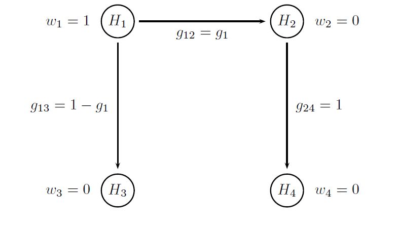



## Summary

The clinical trial example used in this case study is based on a Phase III trial that was conducted to evaluate the efficacy and safety of brexpiprazole, a novel treatment for schizophrenia (Correll et al., 2015). The patient population in the case study will include patients with schizophrenia who experience
an acute exacerbation. The patients will be treated for 6 weeks and will be randomly assigned to a low dose of the experimental treatment (Dose L), high
dose of the experimental treatment (Dose H) or placebo. An unbalanced design with a 1:2:2 randomization scheme will be employed in the trial. The use
of unequal randomization helps provide more information on the treatment’s safety profile and facilitates patient enrollment since patients are more likely
to be allocated to an active treatment.

The case study presents a multiplicity problem with two sources of multiplicity. The two dose-placebo comparisons (Dose L versus placebo and Dose H
versus placebo) will serve as the first source of multiplicity. In addition to that, the efficacy of the experimental treatment will be evaluated using two ordered clinical endpoints:

- Primary endpoint: Change from baseline in the Positive and Negative Syndrome Scale (PANSS) total score.

- Key secondary endpoint: Change from baseline in the Clinical Global Impressions Severity Scale (CGI-S) score.

Note that lower values of the PANSS total score and CGI-S score are associated with improvement and thus negative changes indicate a beneficial
treatment effect. The key secondary endpoint provides supportive evidence of treatment efficacy and significant findings based on both endpoints can be presented in the product label. The analysis of the primary and secondary endpoints defines the second source of multiplicity in this trial.

## Define a Data Model

In this case study, two clinical endpoints are evaluated for each patient (change from baseline in the PANSS total score and change from baseline on the CGI-S score) and thus a bivariate distribution needs to be specified for each patient’s outcome in the data model. A bivariate normal distribution is defined using the `MVNormalDist` method in the `OutcomeDist` object. For each sample and each treatment effect scenario, the parameters of this bivariate distribution as well as the correlation matrix need to be defined. Parameters of the bivariate normal distribution for each expected scenarios are provided in the following table. Finally, the correlation between the two endpoints is set to 0.5.

    <table class="table">
        <thead>
            <tr>
                <th>Endpoint</th>
                <th>Outcome parameter set</th>
                <th>Placebo</th>
                <th>Dose L</th>
                <th>Dose H</th>
            </tr>
        </thead>
        <tbody>
            <tr>
                <td rowspan="5">PANSS total score (mean (SD))</td>
            </tr>
            <tr>
                <td>Scenario 1</td>
                <td>-12 (20)</td>
                <td>-18 (20)</td>
                <td>-20 (20)</td>
            </tr>
            <tr>
                <td>Scenario 2</td>
                <td>-12 (20)</td>
                <td>-18 (20)</td>
                <td>-18 (20)</td>
            </tr>
            <tr>
                <td>Scenario 3</td>
                 <td>-12 (20)</td>
                <td>-18 (20)</td>
                <td>-20 (20)</td>
            </tr>
            <tr>
                <td>Scenario 4</td>
                <td>-12 (20)</td>
                <td>-18 (20)</td>
                <td>-18 (20)</td>
            </tr>
            <tr>
                <td rowspan="5">CGI-S score (mean (SD))</td>
            </tr>
           <tr>
                <td>Scenario 1</td>
                <td>-0.8 (1)</td>
                <td>-1.1 (1)</td>
                <td>-1.1 (1)</td>
            </tr>
            <tr>
                <td>Scenario 2</td>
                <td>-0.8 (1)</td>
                <td>-1.1 (1)</td>
                <td>-1.1 (1)</td>
            </tr>
            <tr>
                <td>Scenario 3</td>
                <td>-0.8 (1)</td>
                <td>-1.2 (1)</td>
                <td>-1.2 (1)</td>
            </tr>
            <tr>
                <td>Scenario 4</td>
                <td>-0.8 (1)</td>
                <td>-1.2 (1)</td>
                <td>-1.2 (1)</td>
            </tr>
        </tbody>
    </table>

The outcome parameters are specified using the following R code.


# Correlation between two endpoints
corr.matrix = matrix(c(1.0, 0.5,
                       0.5, 1.0), 2, 2)

# Outcome parameters - Scenario 1
outcome.placebo.sc1 = parameters(par = parameters(parameters(mean = -12, sd = 20),
                                                  parameters(mean = -0.8, sd = 1)),
                                 corr = corr.matrix)

outcome.dosel.sc1 = parameters(par = parameters(parameters(mean = -18, sd = 20),
                                                parameters(mean = -1.1, sd = 1)),
                               corr = corr.matrix)

outcome.doseh.sc1 = parameters(par = parameters(parameters(mean = -20, sd = 20),
                                                parameters(mean = -1.1, sd = 1)),
                               corr = corr.matrix)

# Outcome parameters - Scenario 2
outcome.placebo.sc2 = parameters(par = parameters(parameters(mean = -12, sd = 20),
                                                  parameters(mean = -0.8, sd = 1)),
                                 corr = corr.matrix)

outcome.dosel.sc2 = parameters(par = parameters(parameters(mean = -18, sd = 20),
                                                parameters(mean = -1.1, sd = 1)),
                               corr = corr.matrix)

outcome.doseh.sc2 = parameters(par = parameters(parameters(mean = -18, sd = 20),
                                                parameters(mean = -1.1, sd = 1)),
                               corr = corr.matrix)

# Outcome parameters - Scenario 3
outcome.placebo.sc3 = parameters(par = parameters(parameters(mean = -12, sd = 20),
                                                  parameters(mean = -0.8, sd = 1)),
                                 corr = corr.matrix)

outcome.dosel.sc3 = parameters(par = parameters(parameters(mean = -18, sd = 20),
                                                parameters(mean = -1.2, sd = 1)),
                               corr = corr.matrix)

outcome.doseh.sc3 = parameters(par = parameters(parameters(mean = -20, sd = 20),
                                                parameters(mean = -1.2, sd = 1)),
                               corr = corr.matrix)

# Outcome parameters - Scenario 4
outcome.placebo.sc4 = parameters(par = parameters(parameters(mean = -12, sd = 20),
                                                  parameters(mean = -1.2, sd = 1)),
                                 corr = corr.matrix)

outcome.dosel.sc4 = parameters(par = parameters(parameters(mean = -18, sd = 20),
                                                parameters(mean = -1.2, sd = 1)),
                               corr = corr.matrix)

outcome.doseh.sc4 = parameters(par = parameters(parameters(mean = -18, sd = 20),
                                                parameters(mean = -1.2, sd = 1)),
                               corr = corr.matrix)



Also, unlike [Case study 1](mult_CaseStudy01.html), this case
study utilized an unbalanced design with a 1:2:2 randomization scheme. The
number of patients in each trial arm, i.e., in each sample, is specified within
each `Sample` object.


# Data model
mult.cs2.data.model = DataModel() +
  OutcomeDist(outcome.dist = "MVNormalDist") +
  Sample(id = c("Placebo - E1", "Placebo - E2"),
         outcome.par = parameters(outcome.placebo.sc1, 
                                  outcome.placebo.sc2, 
                                  outcome.placebo.sc3,
                                  outcome.placebo.sc4),
         sample.size = 100) +
  Sample(id = c("Dose L - E1", "Dose L - E2"),
         outcome.par = parameters(outcome.dosel.sc1, 
                                  outcome.dosel.sc2, 
                                  outcome.dosel.sc3,
                                  outcome.dosel.sc4),
         sample.size = 200) +
  Sample(id = c("Dose H - E1", "Dose H - E2"),
         outcome.par = parameters(outcome.doseh.sc1, 
                                  outcome.doseh.sc2, 
                                  outcome.doseh.sc3,
                                  outcome.doseh.sc4),
         sample.size = 200)


## Define an Analysis Model

The statistical tests carried out in the trial as well as the candidate multiplicity
adjustments are specified in the analysis model. 

As both endpoints follow a normal distribution, the two treatment comparisons for each endpoint will be
carried out based on a two-sample *t*-test. This means that four `Test` objects
need to be defined in the `AnalysisModel` object. It is worth to be noted that as lower values for each endpoint represents an improvement, the active dose must be placed in the first position of the `samples` argument of the `Test` objects.

Both multiplicity adjustments are based on Bonferroni-based chain procedures,
and each procedure is uniquely defined by the alpha-allocation and alpha-propagation rules. The difference between Procedure B1 and Procedure B2
lies in the specification of the alpha-propagation rule, i.e., the set of transition parameters. These procedures are represented in the following figures.

The figure below provides a visual summary of the testing strategy used in this clinical trial. The circles in this figure denote the four null hypotheses of interest:

- H1: Null hypothesis of no difference between Dose L and placebo with respect to Endpoint 1.

- H2: Null hypothesis of no difference between Dose H and placebo with respect to Endpoint 1.

- H3: Null hypothesis of no difference between Dose L and placebo with respect to Endpoint 2.

- H4: Null hypothesis of no difference between Dose H and placebo with respect to Endpoint 2.

  

Procedure B1
    
  

  

Procedure B2
    
  

To specify the procedure-specific alpha-propagation rules, two objects
are introduced below to pass the hypothesis weights and transition parameters
to the multiplicity adjustment procedures:

- `chain.weight` defines a vector of initial hypothesis weights, i.e., W1 in
Procedure B1 and W2 in Procedure B2.

- `chain.transition` defines a matrix of transition parameters, i.e., T1 in
Procedure B1 and T2 in Procedure B2.

Note that the transition parameters used in these procedures are computed using
the optimal values of the target parameters, i.e. g1 = 0.8 in Procedure B1
and g1 = 1 and g2 = 0 in Procedure B2.


# Parameters of the Procedure B1
# Vector of hypothesis weights
chain.weight = c(1, 0, 0, 0)

# Matrix of transition parameters
chain.transition = matrix(c(0, 0.8, 0.2, 0,
                            0, 0, 0, 1,
                            0, 0, 0, 0,
                            0, 0, 0, 0), 4, 4, byrow = TRUE)

# MultAdjProc
mult.adj1 = MultAdjProc(proc = "ChainAdj",
                        par = parameters(weight = chain.weight,
                                         transition = chain.transition))

# Parameters of the Procedure B2
# Vector of hypothesis weights
chain.weight = c(1, 0, 0, 0)

# Matrix of transition parameters
chain.transition = matrix(c(0, 1, 0, 0,
                            0, 0, 0, 1 ,
                            0, 1, 0, 0,
                            0, 0, 1, 0), 4, 4, byrow = TRUE)

# MultAdjProc
mult.adj2 = MultAdjProc(proc = "ChainAdj",
                        par = parameters(weight = chain.weight,
                                         transition = chain.transition))


It is important to note that, as before, the test order in the `AnalysisModel`
object is important to ensure that the alpha-allocation and alpha-propagation rules
are applied correctly.


# Analysis model
mult.cs2.analysis.model = 
  AnalysisModel() +
  MultAdj(mult.adj1,mult.adj2) +
  Test(id = "Placebo vs Dose H - E1",
       samples = samples("Dose H - E1", "Placebo - E1"),
       method = "TTest") +
  Test(id = "Placebo vs Dose L - E1",
       samples = samples("Dose L - E1", "Placebo - E1"),
       method = "TTest") +
  Test(id = "Placebo vs Dose H - E2",
       samples = samples("Dose H - E2", "Placebo - E2"),
       method = "TTest") +
  Test(id = "Placebo vs Dose L - E2",
       samples = samples("Dose L - E2", "Placebo - E2"),
       method = "TTest")

## Define an Evaluation Model

The marginal, weighted and disjunctive power criteria utilized in this cases
study are specified in the `EvaluationModel` object using built-in functions.

However, two custom functions need to be developed for the subset disjunctive
power criterion and partition-based weighted criterion as shown
below.


# Custom evaluation criterion: Subset disjunctive power
mult.cs2.SubsetDisjunctivePower = function(test.result, statistic.result, parameter) {
  
  alpha = parameter$alpha
  
  # Outcome: Reject (H1 or H2) and (H3 or H4)
  power = mean(((test.result[,1] <= alpha) | (test.result[,2] <= alpha)) & 
                 ((test.result[,3] <= alpha) | (test.result[,4] <= alpha)))
  
  return(power)
}

# Custom evaluation criterion: Partition-based weighted power
mult.cs2.PartitionBasedWeightedPower = function(test.result, statistic.result, parameter) {
  
  # Parameters
  alpha = parameter$alpha
  weight = parameter$weight
  
  # Outcomes
  # Outcome1: reject exactly one hypothesis in the primary family
  outcome1 = ((test.result[,1] <= alpha) + (test.result[,2] <= alpha)) == 1
  # Outcome2: reject both hypotheses in the primary family and less than two in the secondary family
  outcome2 = (((test.result[,1] <= alpha) + (test.result[,2] <= alpha)) == 2) &  
    (((test.result[,3] <= alpha) + (test.result[,4] <= alpha)) <= 1)
  # Outcome3: reject both hypotheses in the primary and secondary families
  outcome3 = ((test.result[,1] <= alpha) & (test.result[,2] <= alpha) & (test.result[,3] <= alpha) & (test.result[,4] <= alpha))
  
  # Weighted power
  power = mean(outcome1) * weight[1] + mean(outcome2) * weight[2] + mean(outcome3) * weight[3] 
  
  return(power)
}


Finally, the built-in and custom criterion functions are incorporated into
the `EvaluationModel` object.


# Evaluation model
mult.cs2.evaluation.model = EvaluationModel() +
  Criterion(id = "Marginal power",
            method = "MarginalPower",
            tests = tests("Placebo vs Dose H - E1", 
                          "Placebo vs Dose L - E1", 
                          "Placebo vs Dose H - E2", 
                          "Placebo vs Dose L - E2"),
            labels = c("Placebo vs Dose H - E1", 
                       "Placebo vs Dose L - E1", 
                       "Placebo vs Dose H - E2", 
                       "Placebo vs Dose L - E2"),
            par = parameters(alpha = 0.025)) +
  Criterion(id = "Disjunctive power",
            method = "DisjunctivePower",
            tests = tests("Placebo vs Dose H - E1", 
                          "Placebo vs Dose L - E1", 
                          "Placebo vs Dose H - E2", 
                          "Placebo vs Dose L - E2"),
            labels = "Disjunctive power",
            par = parameters(alpha = 0.025)) +
  Criterion(id = "Subset Disjunctive power",
            method = "mult.cs2.SubsetDisjunctivePower",
            tests = tests("Placebo vs Dose H - E1", 
                          "Placebo vs Dose L - E1", 
                          "Placebo vs Dose H - E2", 
                          "Placebo vs Dose L - E2"),
            labels = "Subset Disjunctive power",
            par = parameters(alpha = 0.025)) +
  Criterion(id = "Weighted power",
            method = "WeightedPower",
            tests = tests("Placebo vs Dose H - E1", 
                          "Placebo vs Dose L - E1", 
                          "Placebo vs Dose H - E2", 
                          "Placebo vs Dose L - E2"),
            labels = "Weighted power (v1 = 0.4, v2 = 0.4, v3 = 0.1, v4 = 0.1)",
            par = parameters(alpha = 0.025, 
                             weight = c(0.4, 0.4, 0.1, 0.1))) +
  Criterion(id = "Partition-based weighted power",
            method = "mult.cs2.PartitionBasedWeightedPower",
            tests = tests("Placebo vs Dose H - E1", 
                          "Placebo vs Dose L - E1", 
                          "Placebo vs Dose H - E2", 
                          "Placebo vs Dose L - E2"),
            labels = "Partition-based weighted power (v1 = 0.20, v2 = 0.35, v3 = 0.45)",
            par = parameters(alpha = 0.025, 
                             weight = c(0.20, 0.35, 0.45)))


## Perform Clinical Scenario Evaluation

Using the data, analysis and evaluation models, simulation-based Clinical Scenario Evaluation is performed by calling the `CSE` function:


# Simulation Parameters
mult.cs2.sim.parameters =  SimParameters(n.sims = 100000,
                                         proc.load = "full",
                                         seed = 42938001)

# Perform clinical scenario evaluation
mult.cs2.results = CSE(mult.cs2.data.model,
                       mult.cs2.analysis.model,
                       mult.cs2.evaluation.model,
                       mult.cs2.sim.parameters)


## Download

Click on the icons below to download the R code used in this case study and report that summarizes the results of Clinical Scenario Evaluation:

  

    
	 
  

  

    
  

