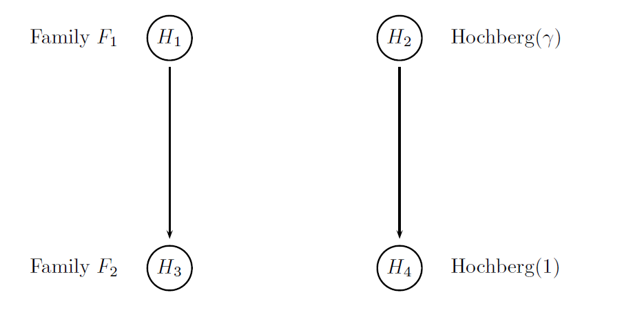



## Summary

The clinical trial example used in this case study is the same as in [Case Study 2](mult_CaseStudy02.html). For a detailed description of this clinical trial, see [Case Study 2](mult_CaseStudy02.html). The difference resides in the multiple testing strategy applied to the null hypotheses, that is based on the Hochberg-based gatekeeping procedure. 

The four null hypotheses will be grouped into two families. The first
two hypotheses corresponding to the null hypotheses associated with the primary endpoint will be placed in the primary family and the
other two hypotheses corresponding to the null hypotheses associated with the secondary endpoint will be placed in the secondary family. This adjustment will be based on a gatekeeping procedure derived from the Hochberg-type tests applied to
the primary and secondary hypotheses and will be referred to as Procedure H.

The figure below provides a visual summary of the testing strategy used in this clinical trial. The circles in this figure denote the four null hypotheses of interest:

- H1: Null hypothesis of no difference between Dose L and placebo with respect to Endpoint 1.

- H2: Null hypothesis of no difference between Dose H and placebo with respect to Endpoint 1.

- H3: Null hypothesis of no difference between Dose L and placebo with respect to Endpoint 2.

- H4: Null hypothesis of no difference between Dose H and placebo with respect to Endpoint 2.

  

    
  

## Define a Data Model

As the data model is exactly the same as the one specified in Case study 2, see [Case Study 2](mult_CaseStudy02.html#DefineaDataModel) for a detailed description of the data model. 

## Define an Analysis Model

The analysis model includes the same four statistical tests as in [Case Study 2](mult_CaseStudy02#DefineanAnalysisModel.html)
and the Hochberg-based gatekeeping procedure. The statistical tests are defined in exactly the same way as in Case study 2. 

A multiple testing procedure known as the multiple-sequence gatekeeping procedure will be applied to account for the hierarchical structure of this multiplicity problem. This procedure belongs to the class of mixture-based gatekeeping procedures introduced in [Dmitrienko et al. (2015)](http://www.tandfonline.com/doi/abs/10.1080/10543406.2015.1074917). This gatekeeping procedure is specified by defining the following three parameters:

- Families of null hypotheses (`family`): defines the allocation of the null hypotheses to the families, i.e., the first and second hypotheses are included in the primary family and the other two in the secondary family.
 
- Component procedures used in the families (`component.procedure`): defines the component procedures used within the
gatekeeping procedure (Hochberg procedures are applied to both families).

- Truncation parameters used in the families (`gamma`): specifies the truncation parameters used in the two families (gamma is set to 0.9 in the primary family and to 1 in the secondary family since the regular Hochberg procedure is used in the last family). These truncation parameters define an optimal gatekeeping procedure derived in this case study.

These parameters are then included in the `MultAdjProc` object and the Hochberg-based gatekeeping procedure is defined using the `MultipleSequenceGatekeepingAdj` method.


# Parameters of the Hochberg-based gatekeeping procedure 
family = families(family1 = c(1, 2), 
                  family2 = c(3, 4))

component.procedure = families(family1="HochbergAdj", 
                               family2="HochbergAdj")

gamma = families(family1 = 0.9, 
                 family2 = 1)

mult.adj = 
  MultAdjProc(proc = "MultipleSequenceGatekeepingAdj",
              par = parameters(family = family, 
                               proc = component.procedure,
                               gamma = gamma),
              tests = tests("Placebo vs Dose H - E1", 
                            "Placebo vs Dose L - E1", 
                            "Placebo vs Dose H - E2",
                            "Placebo vs Dose L - E2"))


The `mult.adj` object is then added to the analysis model as in [Case Study 2](mult_CaseStudy02#DefineanAnalysisModel.html).


# Analysis model
mult.cs3.analysis.model = AnalysisModel() +
  mult.adj +
  Test(id = "Placebo vs Dose H - E1",
       samples = samples("Dose H - E1", "Placebo - E1"),
       method = "TTest") +
  Test(id = "Placebo vs Dose L - E1",
       samples = samples("Dose L - E1", "Placebo - E1"),
       method = "TTest") +
  Test(id = "Placebo vs Dose H - E2",
       samples = samples("Dose H - E2", "Placebo - E2"),
       method = "TTest") +
  Test(id = "Placebo vs Dose L - E2",
       samples = samples("Dose L - E2", "Placebo - E2"),
       method = "TTest")

## Define an Evaluation Model

This case study utilizes tradeoff-based optimization criteria based on disjunctive power and on simple weighted power. The latter can be
directly specified in the evaluation model using the `WeightedPower` method
with the hypothesis weights set to v1v11, v1v12, v2v21 and v2v22, respectively.

As for the tradeoff-based disjunctive criterion, it is not implemented by default
in the Mediana package and a custom function needs to be written and incorporated
into the evaluation model. The `mult.cs3.TradeoffDisjunctivePower`
function, defined below, calculates the probability of rejecting at least one hypothesis
in the primary family and at least one hypothesis in the secondary
family and then returns a weighted sum of these probabilities.


# Custom evaluation criterion: Tradeoff-based disjunctive criterion
mult.cs3.TradeoffDisjunctivePower = function(test.result, statistic.result, parameter) {
  
  alpha = parameter$alpha
  weight = parameter$weight
  
  family1 = ((test.result[,1] <= alpha) | (test.result[,2] <= alpha))
  family2 = ((test.result[,3] <= alpha) | (test.result[,4] <= alpha))
  
  power = weight[1] * mean(family1) + weight[2] * mean(family2)
  
  return(power)
}


Finally, the built-in and custom criterion functions are incorporated into
the `EvaluationModel` object.


# Evaluation model
# Evaluation model
mult.cs3.evaluation.model = EvaluationModel() +
  Criterion(id = "Marginal power",
            method = "MarginalPower",
            tests = tests("Placebo vs Dose H - E1", 
                          "Placebo vs Dose L - E1", 
                          "Placebo vs Dose H - E2", 
                          "Placebo vs Dose L - E2"),
            labels = c("Placebo vs Dose H - E1", 
                       "Placebo vs Dose L - E1", 
                       "Placebo vs Dose H - E2", 
                       "Placebo vs Dose L - E2"),
            par = parameters(alpha = 0.025)) +
  # Disjunctive power criteria
  Criterion(id = "Disjunctive power",
            method = "DisjunctivePower",
            tests = tests("Placebo vs Dose H - E1", 
                          "Placebo vs Dose L - E1", 
                          "Placebo vs Dose H - E2", 
                          "Placebo vs Dose L - E2"),
            labels = "Disjunctive power",
            par = parameters(alpha = 0.025)) +
  Criterion(id = "Disjunctive power - Family 1",
            method = "DisjunctivePower",
            tests = tests("Placebo vs Dose H - E1", 
                          "Placebo vs Dose L - E1"),
            labels = "Disjunctive power",
            par = parameters(alpha = 0.025)) +
  Criterion(id = "Disjunctive power - Family 2",
            method = "DisjunctivePower",
            tests = tests("Placebo vs Dose H - E2", 
                          "Placebo vs Dose L - E2"),
            labels = "Disjunctive power",
            par = parameters(alpha = 0.025)) +
  Criterion(id = "Tradeoff-based disjunctive power (v1 = 0.5, v2 = 0.5)",
            method = "mult.cs3.TradeoffDisjunctivePower",
            tests = tests("Placebo vs Dose H - E1", 
                          "Placebo vs Dose L - E1", 
                          "Placebo vs Dose H - E2", 
                          "Placebo vs Dose L - E2"),
            labels = "Tradeoff-based disjunctive power",
            par = parameters(alpha = 0.025, 
                             weight = c(0.5, 0.5))) +
  Criterion(id = "Tradeoff-based disjunctive power (v1 = 0.8, v2 = 0.2)",
            method = "mult.cs3.TradeoffDisjunctivePower",
            tests = tests("Placebo vs Dose H - E1", 
                          "Placebo vs Dose L - E1", 
                          "Placebo vs Dose H - E2", 
                          "Placebo vs Dose L - E2"),
            labels = "Tradeoff-based disjunctive power",
            par = parameters(alpha = 0.025, 
                             weight = c(0.8, 0.2))) +
  # Weighted power criteria
  Criterion(id = "Weighted power - Family 1",
            method = "WeightedPower",
            tests = tests("Placebo vs Dose H - E1", 
                          "Placebo vs Dose L - E1"),
            labels = "Weighted power",
            par = parameters(alpha = 0.025, 
                             weight = c(0.5, 0.5))) +
  Criterion(id = "Weighted power - Family 2",
            method = "WeightedPower",
            tests = tests("Placebo vs Dose H - E2", 
                          "Placebo vs Dose L - E2"),
            labels = "Weighted power",
            par = parameters(alpha = 0.025, 
                             weight = c(0.5, 0.5))) +
  Criterion(id = "Weighted power (v1 = 0.5, v2 = 0.5)",
            method = "WeightedPower",
            tests = tests("Placebo vs Dose H - E1", 
                          "Placebo vs Dose L - E1", 
                          "Placebo vs Dose H - E2", 
                          "Placebo vs Dose L - E2"),
            labels = "Weighted power",
            par = parameters(alpha = 0.025, 
                             weight = c(0.5*0.5, 0.5*0.5, 0.5*0.5, 0.5*0.5))) +
  Criterion(id = "Weighted power (v1 = 0.8, v2 = 0.2)",
            method = "WeightedPower",
            tests = tests("Placebo vs Dose H - E1", 
                          "Placebo vs Dose L - E1", 
                          "Placebo vs Dose H - E2", 
                          "Placebo vs Dose L - E2"),
            labels = "Weighted power",
            par = parameters(alpha = 0.025, 
                             weight = c(0.8*0.5, 0.8*0.5, 0.2*0.5, 0.2*0.5)))


## Perform Clinical Scenario Evaluation

Using the data, analysis and evaluation models, simulation-based Clinical Scenario Evaluation is performed by calling the `CSE` function:


# Simulation Parameters
mult.cs3.sim.parameters =  SimParameters(n.sims = 100000,
                                         proc.load = "full",
                                         seed = 42938001)

# Perform clinical scenario evaluation
mult.cs3.results = CSE(mult.cs3.data.model, 
                       mult.cs3.analysis.model, 
                       mult.cs3.evaluation.model,
                       mult.cs3.sim.parameters)


## Download

Click on the icons below to download the R code used in this case study and report that summarizes the results of Clinical Scenario Evaluation:

  

    
	 
  

  

    
  

