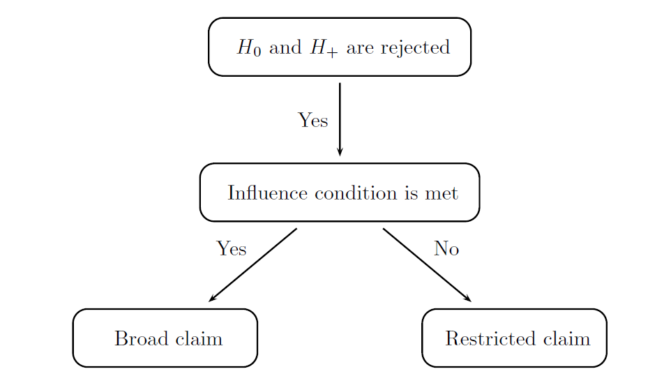



## Summary

The clinical trial example used in this case study is the same as in [Case study 1](subgroup_CaseStudy01). For a detailed description of this clinical trial, see [Case study 1](subgroup_CaseStudy01). The difference resides in the decision strategy in a clinical trial
with two potential regulatory claims, namely, the broad claim of treatment
effectiveness in the overall population and restricted claim that pertains to a
subpopulation of marker-positive patients. 

The influence condition presented in Section 3.2.3 of the [Clinical Trial Optimization Using R](https://www.crcpress.com/Clinical-Trial-Optimization-using-R/Dmitrienko/p/book/9781498735070) serves as a tool for facilitating
the decision-making process in clinical trials with two patient populations.
The condition states that the broad claim of treatment effectiveness
in the overall patient population can be supported only if there is sufficient
evidence of a beneficial treatment effect in the biomarker-negative subset and
thus a significant treatment effect in the overall population is not directly
driven by a strong effect in the biomarker-positive subpopulation. If the influence
condition is met, the trial’s sponsor can rule out the possibility of
incorrectly characterizing the efficacy profile in the overall population.
When the influence condition is taken into account, it is no longer correct
to use the simple rules for making the broad and restricted claims used in
[Case study 1](subgroup_CaseStudy01):

- **Broad claim** of treatment effectiveness in the overall population is made
if the null hypothesis assciated with the overall population (H0) is rejected.

- **Restricted claim** of treatment effectiveness in the subpopulation is made
if the null hypothesis assciated with the biomarker-positive subpopulation (H+) is rejected but H0 is not rejected.

The modified decision rules are displayed in the following figure and can be summarized
as follows:

- **Broad claim** is made if (1) H0 is rejected and H+ is not rejected or (2) H0
and H+ are both rejected and the influence condition is met.

- **Restricted claim** is made if at least one of the two conditions is met: (1)
H+ is rejected but H0 is not rejected or (2) H0 and H+ are both rejected
but the influence condition is not satisfied.

  

    
  

A straightforward frequentist formulation of the influence condition
will be utilized in this case study. The influence condition is said to be met if the estimated effect size in the biomarker-negative subgroup is above a pre-specified non-negative quantity that serves as a threshold for defining
a minimal clinically important effect in the biomarker-negative subpopulation. This parameter will be referred to as the influence threshold. This
inequality shows that a sufficiently large treatment effect is present in the
subset of patients with a biomarker-negative status.

## Define a Data Model

As the data model is exactly the same as the one specified in Case study 1, see [Case Study 1](subgroup_CaseStudy01.html#DefineaDataModel) for a detailed description of the data model.

## Define an Analysis Model

The analysis model includes the same four statistical tests as in [Case Study 1](mult_CaseStudy01#DefineanAnalysisModel.html)
and the weighted Hochberg procedure. The statistical tests are defined in exactly the same way as in Case study 1. 

The computation of the effect size in the biomarker-negative subpopulation is
performed by including the `Statistic` object with the `EffectSizeContStat`
method in the analysis model. This method computes the effect size for normally
distributed endpoints.


# Analysis model
subgroup.cs2.analysis.model = 
  AnalysisModel() +
  Test(id = "OP test",
       samples = samples(c("Placebo Bio-Neg", "Placebo Bio-Pos"),
                         c("Treatment Bio-Neg", "Treatment Bio-Pos")),
       method = "TTest") +
  Test(id = "Bio-Pos test",
       samples = samples("Placebo Bio-Pos", 
                         "Treatment Bio-Pos"),
       method = "TTest") +
  Statistic(id = "Effect Size in Bio-Neg", 
            samples = samples("Placebo Bio-Neg", 
                              "Treatment Bio-Neg"),
            method = "EffectSizeContStat") +
  MultAdjProc(proc = "HochbergAdj",
              par = parameters(weight = c(0.8, 0.2)))


## Define an Evaluation Model

A custom function needs to be defined in the evaluation model to implement
the criterion based on weighted power using the general approach used in [Case Study 1](mult_CaseStudy01#DefineanEvaluationModel.html). The only difference is that, in this case, the `statistic.result` argument of the function will be used to specify the matrix of effect sizes in the
biomarker-negative subpopulation. This custom function computes weighted
power based on the modified broad and restricted claims with the influence
condition.


# Custom evaluation criterion based on weighted power
subgroup.cs2.WeightedPower = function(test.result, statistic.result, parameter)  {
  
  alpha = parameter$alpha
  v1 = parameter$v1
  v2 = parameter$v2
  influence_threshold = parameter$influence_threshold
  
  # Broad claim: (1) Reject OP test but not Bio-Pos or (2) Reject OP and Bio-Pos test and influence condition is met
  broad.claim = ((test.result[,1] <= alpha & test.result[,2] > alpha) | 
                   (test.result[,1] <= alpha & test.result[,2] <= alpha & statistic.result[,1] >= influence_threshold))
  
  # Restricted claim: (1) Reject Bio-Pos test but not OP or (2) Reject Bio-Pos and OP test and influence not met
  restricted.claim = ((test.result[,1] > alpha & test.result[,2] <= alpha) | 
                        (test.result[,1] <= alpha & test.result[,2] <= alpha & statistic.result[,1] < influence_threshold))
  
  power = v1 * mean(broad.claim) + v2 * mean(restricted.claim)
  
  return(power)
}


Custom functions can be written to compute the probabilities of broad and
restricted claims (`subgroup.cs2.BroadClaimPower` and `subgroup.cs2.RestrictedClaimPower`)
in a similar way.


# Custom evaluation criterion based on the probability of a broad claim
subgroup.cs2.BroadClaimPower = function(test.result, statistic.result, parameter)  {
  
  alpha = parameter$alpha
  influence_threshold = parameter$influence_threshold
  
  # Broad claim: Reject OP test but not Bio-Pos test or reject both and influence condition is met
  broad.claim = ((test.result[,1] <= alpha & test.result[,2] > alpha) | 
                   (test.result[,1] <= alpha & test.result[,2] <= alpha & statistic.result[,1] >= influence_threshold))
  
  power = mean(broad.claim)
  
  return(power)
}

# Custom evaluation criterion based on the probability of a restricted claim
subgroup.cs2.RestrictedClaimPower = function(test.result, statistic.result, parameter)  {
  
  alpha = parameter$alpha
  influence_threshold = parameter$influence_threshold
  
  # Restricted claim: Reject Bio-Pos test but not OP test or reject both and influence condition is not met
  restricted.claim = ((test.result[,1] > alpha & test.result[,2] <= alpha) | 
                        (test.result[,1] <= alpha & test.result[,2] <= alpha & statistic.result[,1] < influence_threshold))
  
  power = mean(restricted.claim)
  
  return(power)
}


The resulting evaluation model is presented below. For the purpose of illustration,
the influence threshold (i.e., `influence_threshold`) is set to 0.186
in the `par` argument of the functions for computing weighted power and probabilities
of broad and restricted claims.


# Evaluation model
subgroup.cs2.evaluation.model = 
  EvaluationModel() +
  Criterion(id = "Marginal power",
            method = "MarginalPower",
            tests = tests("OP test", "Bio-Pos test"),
            labels = c("OP test","Bio-Pos test"),
            par = parameters(alpha = 0.025)) + 
  Criterion(id = "Disjunctive power",
            method = "DisjunctivePower",
            tests = tests("OP test", "Bio-Pos test"),
            labels = c("Disjunctive power"),
            par = parameters(alpha = 0.025)) +
  Criterion(id = "Weighted power",
            method = "subgroup.cs2.WeightedPower",
            tests = tests("OP test", "Bio-Pos test"),
            statistics = statistics("Effect Size in Bio-Neg"),
            labels = c("Weighted power"),
            par = parameters(alpha = 0.025, 
                             v1 = 1 / (1 + prevalence.pos), 
                             v2 = prevalence.pos / (1 + prevalence.pos),
                             influence_threshold = 0.186)) + 
  Criterion(id = "Probability of a broad claim",
            method = "subgroup.cs2.BroadClaimPower",
            tests = tests("OP test", "Bio-Pos test"),
            statistics = statistics("Effect Size in Bio-Neg"),
            labels = c("Probability of a broad claim"),
            par = parameters(alpha = 0.025,
                             influence_threshold = 0.186)) + 
  Criterion(id = "Probability of a restricted claim",
            method = "subgroup.cs2.RestrictedClaimPower",
            tests = tests("OP test", "Bio-Pos test"),
            statistics = statistics("Effect Size in Bio-Neg"),
            labels = c("Probability of a restricted claim"),
            par = parameters(alpha = 0.025,
                             influence_threshold = 0.186)) 


## Perform Clinical Scenario Evaluation

Using the data, analysis and evaluation models, simulation-based Clinical Scenario Evaluation is performed by calling the `CSE` function:


# Simulation Parameters
subgroup.cs2.sim.parameters = SimParameters(n.sims = 100000, 
                                            proc.load = "full", 
                                            seed = 42938001)

# Perform clinical scenario evaluation
subgroup.cs2.results = CSE(subgroup.cs2.data.model,
                           subgroup.cs2.analysis.model,
                           subgroup.cs2.evaluation.model,
                           subgroup.cs2.sim.parameters)


## Download

Click on the icons below to download the R code used in this case study and report that summarizes the results of Clinical Scenario Evaluation:

  

    
	 
  

  

    
  

