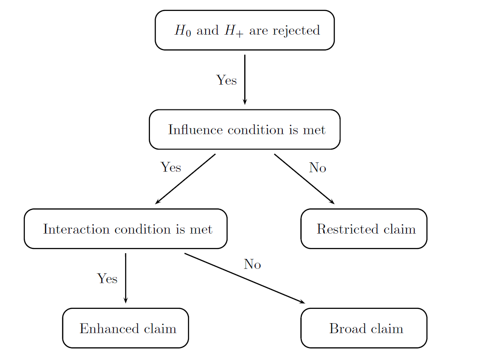



## Summary

The clinical trial example used in this case study is based on the panitumumab
trial in a population of patients with metastatic colorectal cancer (Amado et
al., 2008). Using the same patient population, consider a Phase III trial for a
novel treatment versus control (best supportive care) that utilizes a balanced
design with a 1:1 randomization scheme. The treatment is a fully human antibody against the EGFR (epidermal growth factor receptor) and is expected to
benefit mostly patients in a pre-specified subset. This subset is defined based
on each patient’s KRAS (Kirsten rat sarcoma viral oncogene homolog) status
and includes patients with wild-type KRAS. These patients will be referred
to as biomarker-positive patients and patients with a mutated KRAS status
will be referred to as biomarker-negative patients. For simplicity, it will be
assumed that the KRAS status can be ascertained in all patients. The treatment
effect in this two-arm trial will be evaluated based on progression-free
survival (PFS).

The decision-making rules will be set up using the influence
and interaction conditions defined in Section 3.2.3 of the [Clinical Trial Optimization Using R](https://www.crcpress.com/Clinical-Trial-Optimization-using-R/Dmitrienko/p/book/9781498735070). 

The influence condition has been defined in [Case study 2](subgroup_CaseStudy02). Additional restrictions based on the influence condition as well as the interaction condition are required in a more general setting with three potential
efficacy claims (broad, restricted and enhanced claims) to prevent illogical
conclusions. 

Beginning with a basic decision rule for formulating efficacy claims based
on statistical considerations, the trial’s sponsor can consider pursuing the enhanced
claim of a beneficial effect in the overall population as well as the
selected subpopulation (combination of the broad and restricted claims) if
the two null hypotheses of interest (H0 and H+) are simultaneously rejected. It is immediately clear that this rule does not account for the
influence condition and, as a consequence, may lead to erroneous conclusions
discussed above. Another potential problem with this naive rule is that the
enhanced claim can be recommended even if the treatment effect is homogeneous
across the biomarker-positive and biomarker-negative subsets. This
may happen if the biomarker that was believed to have predictive properties
turned out to be non-informative. 

To address the limitations of the basic decision rule, the interaction condi-
tion needs to be applied in conjunction with the influence condition as shown
in the Figure below:

  

    
  

This figure defines the recommended set of decision rules for
trials with three potential claims. The influence and interaction conditions are
applied sequentially. The latter assesses the degree of treatment-by-biomarker
interaction or strength of a differential effect in the biomarker-positive and
biomarker-negative subgroups. The condition is satisfied if there is a clinically
important interaction that supports the conclusion that the treatment
provides a substantial additional benefit in patients with a biomarker-positive
status compared to patients in the overall population. The interaction condition
can be assessed using any treatment-by-biomarker interaction test. This condition can be defined
using a simple test based on the ratio of the observed effect sizes in
the biomarker-positive and biomarker-negative subgroups (i.e., the interaction
condition is satisfied if this ratio is greater than a pre-defined threshold).

The figure shows that the enhanced claim can be made only if the interaction
condition is satisfied. If no differential effect is observed and thus the
interaction condition is not met, the biomarker is not useful in terms of predicting
patients who experience enhanced benefit. In this case the best course
of action is to focus on treatment effectiveness in the overall population of
patients and pursue the broad claim.

## Define a Data Model

A data model specifies a scheme for generating individual patients’ data in
the set of pre-defined samples, i.e., non-overlapping homogeneous groups of
patients, in a clinical trial. In this case study, the overall population of patients
is naturally split into four samples that are defined as follows:

- Sample 1 (`Placebo Bio-Neg`) includes biomarker-negative patients in the
placebo arm.

- Sample 2 (`Placebo Bio-Pos`) includes biomarker-positive patients in the
placebo arm.

- Sample 3 (`Treatment Bio-Neg`) includes biomarker-negative patients in
the treatment arm.

- Sample 4 (`Treatment Bio-Pos`) includes biomarker-positive patients in
the treatment arm.

Using this definition of samples, the trial’s sponsor can model the fact that the
treatment’s effect is most pronounced in patients with a biomarker-positive
status.

For each sample in the data model, the parameters of the outcome distribution
(i.e., hazard rate) defined in the following Table are
listed in a single set of outcome parameters.

    <table class="table">
        <thead>
            <tr>
                <th>Sample</th>
                <th>Median time (months)</th>
                <th>Hazard rate</th>
            </tr>
        </thead>
        <tbody>
            <tr>
                <td>Placebo Bio-Neg</td>
                <td>7.5</td>
                <td>0.092</td>
            </tr>
            <tr>
                <td>Placebo Bio-Pos</td>
                <td>7.5</td>
                <td>0.092</td>
            </tr>
            <tr>
                <td>Treatment Bio-Neg</td>
                <td>8.5</td>
                <td>0.082</td>
            </tr>
            <tr>
                <td>Treatment Bio-Pos</td>
                <td>12.5</td>
                <td>0.055</td>
            </tr>
        </tbody>
    </table>

The outcome parameters are specified using the following R code.


# Outcome parameters
outcome.placebo.neg = parameters(rate = log(2)/7.5)
outcome.treatment.neg = parameters(rate = log(2)/8.5)
outcome.placebo.pos = parameters(rate = log(2)/7.5)
outcome.treatment.pos = parameters(rate = log(2)/12.5)


It is important to note that, if no censoring mechanism is specified in a data
model with a time-to-event endpoint, all patients will reach the endpoint of
interest (i.e., progression) and thus the number of patients will be equal to the
number of events. Using this property, it is sufficient to define the number of
patients in each sample, according to the prevalence of biomarker-negative and
biomarker-positive patients. The prevalence of biomarker-positive patients in
the general population (`prevalence.pos`) is set to 0.55.


# Sample size parameters
prevalence.pos = 0.55
sample.size.total = 270

sample.size.placebo.neg = round(((1-prevalence.pos) / 2) * sample.size.total)
sample.size.placebo.pos = round((prevalence.pos / 2 * sample.size.total))
sample.size.treatment.neg = round(((1-prevalence.pos) / 2) * sample.size.total)
sample.size.treatment.pos = round((prevalence.pos / 2 * sample.size.total))


Finally, the data model can be set up by initializing the `DataModel` object
and adding each component to it. The outcome distribution is defined using
the `OutcomeDist` object with the `ExpoDist` distribution. The data model
is shown below.


# Data model
subgroup.cs3.data.model = 
  DataModel() +
  OutcomeDist(outcome.dist = "ExpoDist") +
  Sample(id = "Placebo Bio-Neg",
         sample.size = sample.size.placebo.neg,
         outcome.par = parameters(outcome.placebo.neg)) +
  Sample(id = "Placebo Bio-Pos",
         sample.size = sample.size.placebo.pos,
         outcome.par = parameters(outcome.placebo.pos)) +
  Sample(id = "Treatment Bio-Neg",
         sample.size = sample.size.treatment.neg,
         outcome.par = parameters(outcome.treatment.neg)) +
  Sample(id = "Treatment Bio-Pos",
         sample.size = sample.size.treatment.pos,
         outcome.par = parameters(outcome.treatment.pos))


By default, the outcome type is set to fixed, which means that a design
with a fixed patient follow-up is assumed even though the primary endpoint
in this clinical trial is a time-to-event endpoint. This is due to the fact that,
as was explained earlier, no censoring is assumed in this trial and all patients
are followed until the event of interest (disease progression) is observed. In the
presence of censoring, the outcome type will be set to `event` and the design
parameters, e.g., length of the enrollment and follow-up periods, will need to
be specified as well.

## Define an Analysis Model

The analysis model in this clinical trial is very similar to the one defined in [Case study 2](subgroup_CaseStudy02). The only components of the model that need to be modified
are the statistical method utilized in the primary analysis (`method =
"LogrankTest"`) and method for computing the effect size in the biomarker-negative
subpopulation (`method = "EffectSizeEventStat"`). In addition,
the ratio of effect sizes between the biomarker-positive and biomarker-negative
subpopulations needs to be computed. This is accomplished by specifying
a `Statistic` object with the `RatioEffectSizeEventStat` method. This
method computes the ratio of effect sizes for exponentially distributed endpoints.


# Analysis model
subgroup.cs3.analysis.model = 
  AnalysisModel() +
  Test(id = "OP test",
       samples = samples(c("Placebo Bio-Neg", "Placebo Bio-Pos"),
                         c("Treatment Bio-Neg", "Treatment Bio-Pos")),
       method = "LogrankTest") +
  Test(id = "Bio-Pos test",
       samples = samples("Placebo Bio-Pos", 
                         "Treatment Bio-Pos"),
       method = "LogrankTest") +
  Statistic(id = "Effect Size in Bio-Neg", 
            samples = samples("Placebo Bio-Neg", "Treatment Bio-Neg"),
            method = "EffectSizeEventStat") +
  Statistic(id = "Ratio Effect Size Bio-Pos vs Bio-Neg", 
            samples = samples("Placebo Bio-Pos", 
                              "Treatment Bio-Pos", 
                              "Placebo Bio-Neg", 
                              "Treatment Bio-Neg"),
            method = "RatioEffectSizeEventStat")   +
  MultAdjProc(proc = "HochbergAdj",
              par = parameters(weight = c(0.8, 0.2)))


## Define an Evaluation Model

As in the evaluation model used in [Case study 2](subgroup_CaseStudy02), custom functions need
to be written to support the evaluation of the probabilities of the individual
claims and weighted power. Note that the definitions of broad, restricted
and enhanced claims need to be updated to account for the interaction condition
(see [Summary](subgroup_CaseStudy03.html#Summary)). As an illustration, a custom function for computing weighted power (`subgroup.cs3.WeightedPower`) is defined below. The `statistic.result` argument in the
`subgroup.cs3.WeightedPower` function is a matrix containing the value of
the effect size in the biomarker-negative subpopulation and the ratio of effect
sizes between the two subpopulations.


# Custom evaluation criterion based on weighted power
subgroup.cs3.WeightedPower = function(test.result, statistic.result, parameter)  {
  
  alpha = parameter$alpha
  v1 = parameter$v1
  v2 = parameter$v2
  v3 = parameter$v3
  influence_threshold = parameter$influence_threshold
  interaction_threshold = parameter$interaction_threshold
  
  
  # Broad claim: (1) Reject OP test but not Bio-Pos or (2) Reject OP and Bio-Pos test and influence condition is met but the interaction condition is not met
  broad.claim = ((test.result[,1] <= alpha & test.result[,2] > alpha) | 
                   (test.result[,1] <= alpha & test.result[,2] <= alpha & statistic.result[,1] >= influence_threshold & statistic.result[,2] < interaction_threshold))
  
  # Restricted claim: (1) Reject Bio-Pos test but not OP or (2) Reject Bio-Pos and OP test and influence not met
  restricted.claim = ((test.result[,1] > alpha & test.result[,2] <= alpha) | 
                        (test.result[,1] <= alpha & test.result[,2] <= alpha & statistic.result[,1] < influence_threshold))
  
  # Enhanced claim: (1) Reject Bio-Pos and OP test or reject both and influence not met
  enhanced.claim = ((test.result[,1] <= alpha & test.result[,2] <= alpha & statistic.result[,1] >= influence_threshold & statistic.result[,2] >= interaction_threshold))
  
  power = v1 * mean(broad.claim) + v2 * mean(restricted.claim) + v3 * mean(enhanced.claim)
  
  return(power)
}


A similar approach can be applied to create a custom function for computing
the marginal probability of a broad, restricted and enhanced claims. These functions are defined below.


# Custom evaluation criterion based on the probability of a broad claim
subgroup.cs3.BroadClaimPower = function(test.result, statistic.result, parameter)  {
  
  alpha = parameter$alpha
  influence_threshold = parameter$influence_threshold
  interaction_threshold = parameter$interaction_threshold
  
  # Broad claim: (1) Reject OP test but not Bio-Pos or (2) Reject OP and Bio-Pos test and influence condition is met but the interaction condition is not met
  broad.claim = ((test.result[,1] <= alpha & test.result[,2] > alpha) | (test.result[,1] <= alpha & test.result[,2] <= alpha & statistic.result[,1] >= influence_threshold & statistic.result[,2] < interaction_threshold))
  
  power = mean(broad.claim)
  
  return(power)
}

# Custom evaluation criterion based on the probability of a restricted claim
subgroup.cs3.RestrictedClaimPower = function(test.result, statistic.result, parameter)  {
  
  alpha = parameter$alpha
  influence_threshold = parameter$influence_threshold
  
  # Restricted claim: (1) Reject Bio-Pos test but not OP or (2) Reject Bio-Pos and OP test and influence not met
  restricted.claim = ((test.result[,1] > alpha & test.result[,2] <= alpha) | (test.result[,1] <= alpha & test.result[,2] <= alpha & statistic.result[,1] < influence_threshold))
  
  power = mean(restricted.claim)
  
  return(power)
}

# Custom evaluation criterion based on the probability of an enhanced claim
subgroup.cs3.EnhancedClaimPower = function(test.result, statistic.result, parameter)  {
  
  alpha = parameter$alpha
  influence_threshold = parameter$influence_threshold
  interaction_threshold = parameter$interaction_threshold
  
  # Enhanced claim: (1) Reject Bio-Pos and OP test or reject both and influence not met
  enhanced.claim = ((test.result[,1] <= alpha & test.result[,2] <= alpha & statistic.result[,1] >= influence_threshold & statistic.result[,2] >= interaction_threshold))
  
  power = mean(enhanced.claim)
  
  return(power)
}



The evaluation model is presented below. The influence threshold (`influence_threshold`)
and interaction threshold (`interaction_threshold`) are set to their optimal
values, i.e., 0.15 and 1.5, respectively, in the computation of the probabilities
of the three claims of interest and weighted power.


subgroup.cs3.evaluation.model = 
  EvaluationModel() +
  Criterion(id = "Marginal power",
            method = "MarginalPower",
            tests = tests("OP test", "Bio-Pos test"),
            labels = c("OP test","Bio-Pos test"),
            par = parameters(alpha = 0.025)) + 
  Criterion(id = "Disjunctive power",
            method = "DisjunctivePower",
            tests = tests("OP test", "Bio-Pos test"),
            labels = c("Disjunctive power"),
            par = parameters(alpha = 0.025)) +
  Criterion(id = "Weighted power",
            method = "subgroup.cs3.WeightedPower",
            tests = tests("OP test", "Bio-Pos test"),
            statistics = statistics("Effect Size in Bio-Neg",
                                    "Ratio Effect Size Bio-Pos vs Bio-Neg"),
            labels = c("Weighted power (with conditions)"),
            par = parameters(alpha = 0.025, 
                             v1 = 1 / (2 * (1 + prevalence.pos)), 
                             v2 = prevalence.pos / (2 * (1 + prevalence.pos)),
                             v3 = 1/2,
                             influence_threshold = 0.15,
                             interaction_threshold = 1.5)) + 
  Criterion(id = "Probability of a broad claim",
            method = "subgroup.cs3.BroadClaimPower",
            tests = tests("OP test", "Bio-Pos test"),
            statistics = statistics("Effect Size in Bio-Neg",
                                    "Ratio Effect Size Bio-Pos vs Bio-Neg"),
            labels = c("Probability of a broad claim"),
            par = parameters(alpha = 0.025, 
                             influence_threshold = 0.15,
                             interaction_threshold = 1.5)) + 
  Criterion(id = "Probability of a restricted claim",
            method = "subgroup.cs3.RestrictedClaimPower",
            tests = tests("OP test", "Bio-Pos test"),
            statistics = statistics("Effect Size in Bio-Neg",
                                    "Ratio Effect Size Bio-Pos vs Bio-Neg"),
            labels = c("Probability of a restricted claim"),
            par = parameters(alpha = 0.025, 
                             influence_threshold = 0.15,
                             interaction_threshold = 1.5)) + 
  Criterion(id = "Probability of an enhanced claim",
            method = "subgroup.cs3.EnhancedClaimPower",
            tests = tests("OP test", "Bio-Pos test"),
            statistics = statistics("Effect Size in Bio-Neg",
                                    "Ratio Effect Size Bio-Pos vs Bio-Neg"),
            labels = c("Probability of an enhanced claim"),
            par = parameters(alpha = 0.025, 
                             influence_threshold = 0.15,
                             interaction_threshold = 1.5))


## Perform Clinical Scenario Evaluation

Using the data, analysis and evaluation models, simulation-based Clinical Scenario Evaluation is performed by calling the `CSE` function:


# Simulation Parameters
subgroup.cs3.sim.parameters = SimParameters(n.sims = 100000, 
                                            proc.load = "full", 
                                            seed = 42938001)

# Perform clinical scenario evaluation
subgroup.cs3.results = CSE(subgroup.cs3.data.model,
                           subgroup.cs3.analysis.model,
                           subgroup.cs3.evaluation.model,
                           subgroup.cs3.sim.parameters)


## Download

Click on the icons below to download the R code used in this case study and report that summarizes the results of Clinical Scenario Evaluation:

  

    
	 
  

  

    
  

